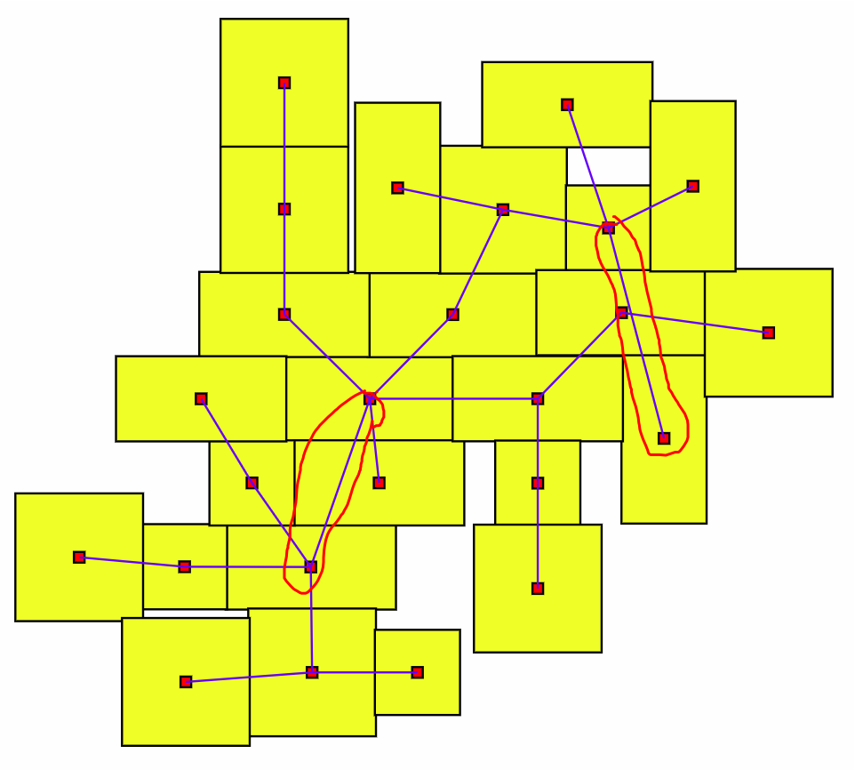

## Issues:
- [ ] `generateTree` generates layout that can't be placed on 2D plane. Example:

Solution: limit adjacent vertices count to 3-4? Or maybe it won't be a problem with proper doors, because we won't have multiple corridors connected to the same door.

- [ ] Unstable results, even though I've seeded every random event (or maybe they are stable? Because I've got the same result for tree layout with 100 vertices as yesterday).

## TODO:
- [ ] Create a generator with proper doors. For now it's fine to have a tree graph structure.
- [ ] Add unit-tests. Especially I must test correctness of my functions and their gradients.
- [ ] Implement anti-density function that pushes disconnected rooms away from each other. Maybe this will lower count of "bad corridors"?
- [ ] Add coordinates normalization? Don't really now is it relevant in this task or not, but maybe worth implementing and testing.
- [ ] Algorithm for fixing solution imperfections? Maybe remove some edges and add new ones?

